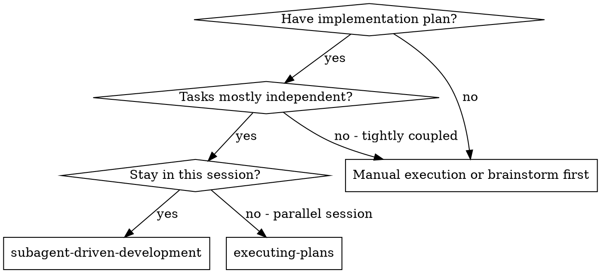
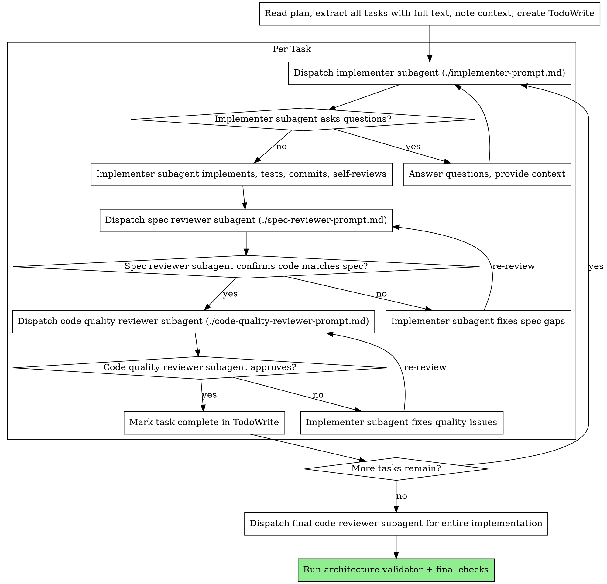

# Subagent-Driven Development

Execute plan by dispatching fresh subagent per task, with two-stage review after each: spec compliance review first, then code quality review. For independent tasks, use parallel batch dispatch for maximum throughput.

**Core principle:** Fresh subagent per task + parallel batches for independent work + two-stage review (spec then quality) = high quality, fast iteration

## When to Use



**vs. Executing Plans (parallel session):**
- Same session (no context switch)
- Fresh subagent per task (no context pollution)
- Two-stage review after each task: spec compliance first, then code quality
- Faster iteration (no human-in-loop between tasks)
- Parallel batches for independent tasks (Nx speedup)
- Explicit dependency analysis prevents conflicts

## The Process



## Parallel Batch Workflow

When tasks are independent, dispatch multiple implementers in parallel for maximum throughput. See `.claude/rules/parallel-orchestration.md` for the full decomposition algorithm.

### Step 1: Task Decomposition
For each task, identify:
- **Target files**: Which files will be created/modified
- **Target packages**: Which @omnifol/* packages are affected
- **Dependencies**: What imports/services does this task rely on
- **Outputs**: What does this task produce that others might consume

### Step 2: Dependency Analysis
Classify each task pair as INDEPENDENT or DEPENDENT:

**INDEPENDENT (can parallel)** - ALL must be true:
- Different target files (no shared edits)
- Different packages OR no import relationship between targets
- No shared tRPC procedures or services
- No producer-consumer relationship (one task's output isn't another's input)
- Can be merged without conflicts

**DEPENDENT (must sequence)** - ANY means dependent:
- Same target files
- Import relationship exists between targets
- Shared service/procedure modifications
- One task produces what another consumes
- Same database table with potential conflicts

### Step 3: Batch Formation
Group independent tasks into batches:
- Max 4 tasks per batch
- Group by independence, not by similarity
- Put dependent tasks in separate batches (ordered)
- Security-sensitive tasks ALWAYS in their own batch (last)
- Hard sequential constraints (database-migration, strategy-implementer compiler, security-auditor) get their own batch

### Step 4: Parallel Dispatch
Send ALL batch implementers in a single message with multiple Task tool calls:

```
[Single message with multiple Task tool calls]
Task 1: Dispatch implementer for "Add utils helper function"
  Batch Context: batch-1, position 1 of 3, files: [scope], peers: [Task 2, Task 3]
Task 2: Dispatch implementer for "Create UI component"
  Batch Context: batch-1, position 2 of 3, files: [scope], peers: [Task 1, Task 3]
Task 3: Dispatch implementer for "Add API endpoint"
  Batch Context: batch-1, position 3 of 3, files: [scope], peers: [Task 1, Task 2]
```

**Critical**: Must be single message for true parallelism. Sequential messages = sequential execution.

### Step 5: Join Point Protocol
After batch completes:
1. Collect file manifests from all agents (files created/modified/deleted + commit SHAs)
2. Check for conflicts (two agents modified same file = decomposition error)
3. Verify integration: `pnpm typecheck && pnpm lint`
4. If verification fails, identify which agent's changes caused it and re-dispatch

### Step 6: Batch-Aware Review
1. Dispatch spec-reviewer with ALL batch changes and per-task specs
2. If issues: collect fixes, dispatch in next batch
3. Dispatch code-quality-reviewer (ONLY after spec passes) with batch context
4. If issues: collect fixes, dispatch in next batch
5. Mark batch tasks complete

### Step 7: Track Batch State
Use TaskCreate metadata for each task in a batch:
```json
{
  "batchId": "batch-1",
  "batchPosition": 1,
  "batchTotal": 3,
  "targetPackages": ["@omnifol/utils"],
  "targetFiles": ["packages/shared/utils/src/date.ts"],
  "status": "dispatched",
  "commitSHA": null
}
```

### Step 8: Iterate
Repeat for remaining batches until all tasks complete.

### Parallel Batch Example

```
Plan has 6 tasks:
- Task 1: Add date utils (packages/utils)
- Task 2: Create DatePicker UI (packages/ui)
- Task 3: Add user.getProfile endpoint (packages/api)
- Task 4: Add useProfile hook (packages/hooks) - DEPENDS on Task 3
- Task 5: Update Member schema (packages/database)
- Task 6: Add payment webhook (packages/api) - SECURITY

Analysis:
- Tasks 1, 2, 3 are independent (different packages, no imports)
- Task 4 depends on Task 3 (imports the endpoint types)
- Task 5 is a database migration (hard sequential constraint)
- Task 6 is security-sensitive (must be isolated)

Batches:
- Batch 1 (parallel): Tasks 1, 2, 3
- Batch 2 (sequential): Task 5 (database migration)
- Batch 3 (sequential): Task 4 (depends on Task 3)
- Batch 4 (security, isolated): Task 6

Execution:
[Batch 1: Dispatch 3 implementers IN PARALLEL (single message, multiple Task calls)]
[Wait for all 3 to complete]
[Join point: collect manifests, verify types/lint]
[Batch-aware spec review]
[Batch-aware code quality review]
[Batch 2: Dispatch database-migration agent for Task 5]
[Two-stage review]
[Batch 3: Dispatch implementer for Task 4]
[Two-stage review]
[Batch 4: Dispatch implementer for Task 6]
[Two-stage review]
[Dispatch security-auditor for Task 6]
[Complete]
```

## Security-Sensitive Work (NEVER Parallel)

For auth, payments, PII changes:
1. Complete all other batches first
2. Dispatch single implementer (isolated batch)
3. Two-stage review (spec → quality)
4. THEN dispatch security-auditor (sequential, Opus model)
5. No other work during security review
6. Block merge on any critical security issues

Security tasks are ALWAYS:
- In their own batch (never grouped with others)
- Executed last (after all other work)
- Reviewed by security-auditor after implementation review
- Never parallelized

## Prompt Templates

- `./implementer-prompt.md` - Dispatch implementer subagent
- `./spec-reviewer-prompt.md` - Dispatch spec compliance reviewer subagent
- `./code-quality-reviewer-prompt.md` - Dispatch code quality reviewer subagent

## Example Workflow

```
You: I'm using Subagent-Driven Development to execute this plan.

[Read plan file once: docs/plans/feature-plan.md]
[Extract all 5 tasks with full text and context]
[Create TodoWrite with all tasks]

Task 1: Hook installation script

[Get Task 1 text and context (already extracted)]
[Dispatch implementation subagent with full task text + context]

Implementer: "Before I begin - should the hook be installed at user or system level?"

You: "User level (~/.config/omnifol/hooks/)"

Implementer: "Got it. Implementing now..."
[Later] Implementer:
  - Implemented install-hook command
  - Added tests, 5/5 passing
  - Self-review: Found I missed --force flag, added it
  - Committed

[Dispatch spec compliance reviewer]
Spec reviewer: ✅ Spec compliant - all requirements met, nothing extra

[Get git SHAs, dispatch code quality reviewer]
Code reviewer: Strengths: Good test coverage, clean. Issues: None. Approved.

[Mark Task 1 complete]

Task 2: Recovery modes

[Get Task 2 text and context (already extracted)]
[Dispatch implementation subagent with full task text + context]

Implementer: [No questions, proceeds]
Implementer:
  - Added verify/repair modes
  - 8/8 tests passing
  - Self-review: All good
  - Committed

[Dispatch spec compliance reviewer]
Spec reviewer: ❌ Issues:
  - Missing: Progress reporting (spec says "report every 100 items")
  - Extra: Added --json flag (not requested)

[Implementer fixes issues]
Implementer: Removed --json flag, added progress reporting

[Spec reviewer reviews again]
Spec reviewer: ✅ Spec compliant now

[Dispatch code quality reviewer]
Code reviewer: Strengths: Solid. Issues (Important): Magic number (100)

[Implementer fixes]
Implementer: Extracted PROGRESS_INTERVAL constant

[Code reviewer reviews again]
Code reviewer: ✅ Approved

[Mark Task 2 complete]

...

[After all tasks]
[Dispatch final code-reviewer]
Final reviewer: All requirements met, ready to merge

Done!
```

## Advantages

**vs. Manual execution:**
- Subagents follow TDD naturally
- Fresh context per task (no confusion)
- Parallel-safe (subagents don't interfere when independent)
- Subagent can ask questions (before AND during work)

**vs. Executing Plans:**
- Same session (no handoff)
- Continuous progress (no waiting)
- Review checkpoints automatic

**Efficiency gains:**
- No file reading overhead (controller provides full text)
- Controller curates exactly what context is needed
- Subagent gets complete information upfront
- Questions surfaced before work begins (not after)

**Parallel batch gains:**
- N independent tasks complete in ~1x time (not Nx time)
- Batch-level reviews reduce review overhead
- Natural grouping identifies hidden dependencies
- Forces upfront dependency analysis (catches issues early)
- Security isolation is explicit and enforced

**Quality gates:**
- Self-review catches issues before handoff
- Two-stage review: spec compliance, then code quality
- Review loops ensure fixes actually work
- Spec compliance prevents over/under-building
- Code quality ensures implementation is well-built

**Cost:**
- More subagent invocations (implementer + 2 reviewers per task)
- Controller does more prep work (extracting all tasks upfront)
- Review loops add iterations
- But catches issues early (cheaper than debugging later)

## Red Flags

**Never:**
- Skip reviews (spec compliance OR code quality)
- Proceed with unfixed issues
- Make subagent read plan file (provide full text instead)
- Skip scene-setting context (subagent needs to understand where task fits)
- Ignore subagent questions (answer before letting them proceed)
- Accept "close enough" on spec compliance (spec reviewer found issues = not done)
- Skip review loops (reviewer found issues = implementer fixes = review again)
- Let implementer self-review replace actual review (both are needed)
- **Start code quality review before spec compliance is ✅** (wrong order)
- Move to next task while either review has open issues

**Parallel-Specific Red Flags:**
- Parallelize tasks that touch the same files (will conflict)
- Parallelize tasks with import dependencies (ordering matters)
- Skip dependency analysis before parallel dispatch
- Send parallel dispatches in separate messages (defeats parallelism)
- Parallelize security-sensitive work (ALWAYS sequential + isolated)
- Parallelize security-auditor reviews
- Group more than 5 tasks in a batch (diminishing returns, harder to debug)
- Mix security tasks with non-security tasks in same batch
- Skip independence analysis before parallel dispatch (default to sequential if unsure)
- Allow agents to modify files outside their declared scope
- Lose batch state during compaction (save to MEMORY.md + TaskCreate metadata)

**If subagent asks questions:**
- Answer clearly and completely
- Provide additional context if needed
- Don't rush them into implementation

**If reviewer finds issues:**
- Implementer (same subagent) fixes them
- Reviewer reviews again
- Repeat until approved
- Don't skip the re-review

**If subagent fails task:**
- Dispatch fix subagent with specific instructions
- Don't try to fix manually (context pollution)

## Integration

**Required Omnifol agents:**
- **implementer** - Primary code implementation agent
- **spec-reviewer** - Spec compliance review (FIRST review gate)
- **code-quality-reviewer** - Code quality review (SECOND review gate)
- **security-auditor** - Deep security review for auth/exchange APIs/financial data (Opus model)

**Domain experts (read-only advisors):**
- **trading-domain-expert** - Orders, positions, balances, exchange APIs
- **omniscript-domain-expert** - DSL grammar, compiler phases, strategy patterns

**Supporting agents:**
- **test-runner** - Test execution and fixes
- **architecture-validator** - Layer rule validation
- **debugger** - Root cause analysis

**Specialized implementers:**
- **database-migration** - Prisma schema changes
- **trpc-procedure** - tRPC endpoints
- **ui-component** - UI development
- **hook-query** - React hooks / TanStack Query
