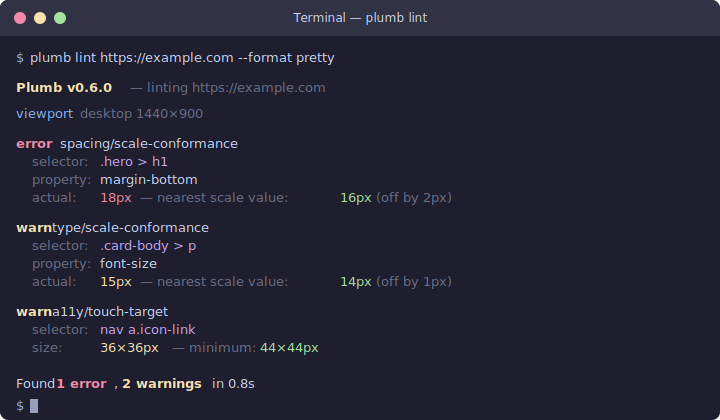

<p align="center">
  <a href="https://plumb.aramhammoudeh.com">
    
  </a>
</p>

<p align="center"><strong>A deterministic design-system linter for rendered websites, not the code behind it.</strong></p>

<p align="center">
<a href="https://github.com/aram-devdocs/plumb/actions/workflows/ci.yml"></a>
<a href="https://crates.io/crates/plumb-cli"></a>
<a href="https://docs.rs/plumb-core"></a>
<a href="https://www.npmjs.com/package/plumb-cli"></a>
<a href="https://codecov.io/gh/aram-devdocs/plumb"></a>
<a href="#license"></a>
<a href="https://www.rust-lang.org"></a>
</p>

Plumb opens a web page in a headless browser at multiple viewports, extracts the computed DOM, and measures it against a declarative design-system spec. It emits structured, pixel-precise violations an AI coding agent can fix in one shot — "ESLint for rendered websites."

Plumb ships as a single Rust binary with two entry points:

- A **CLI** (`plumb lint <url>`) for developers and CI.
- An **MCP server** (`plumb mcp`) that exposes tools to AI coding agents (Claude Code, Cursor, Codex, Windsurf) via the Model Context Protocol.

## Demo

`plumb lint` against any URL produces structured, pixel-precise violations grouped by viewport, rule, and selector:

<p align="center">
  
</p>

## Install

```bash
# Install script (macOS / Linux / Windows)
curl -LsSf https://plumb.aramhammoudeh.com/install.sh | sh

# Cargo
cargo install plumb-cli

# Homebrew
brew install aram-devdocs/plumb/plumb

# npm
npm i -g plumb-cli
```

> **Intel Mac**: native binaries return when [#269](https://github.com/aram-devdocs/plumb/issues/269) closes. Use `cargo install plumb-cli` in the meantime.

Per-channel notes, version pinning, and offline attestation verification live in the [Install](https://plumb.aramhammoudeh.com/install.html) page.

## Documentation

- [The Plumb Book](https://plumb.aramhammoudeh.com) — install, quick start, CLI, configuration, MCP, rules.
- [Contributing](CONTRIBUTING.md)
- [Security policy](SECURITY.md)
- [Changelog](CHANGELOG.md)

## License

Dual-licensed under either of:

- Apache License, Version 2.0 ([LICENSE-APACHE](LICENSE-APACHE))
- MIT License ([LICENSE-MIT](LICENSE-MIT))

at your option.

Unless you explicitly state otherwise, any contribution intentionally submitted for inclusion in Plumb by you, as defined in the Apache-2.0 license, shall be dual-licensed as above, without any additional terms or conditions.
