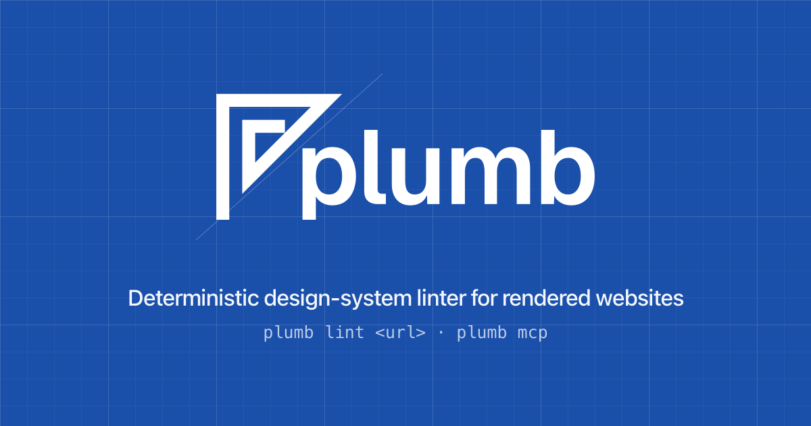

# Plumb brand assets

The Plumb mark is a set square sighting down a plumb line — the carpenter's
test for *straight and true*, which is exactly what the linter checks a
rendered page against. Drawn on a construction grid, it doubles as a nod to
the spacing grids Plumb enforces.

  

## Colour

| Token | Hex | Use |
|-------|-----|-----|
| Brand blue | `#1a4faa` | primary mark, links, accents on light backgrounds |
| Brand blue (on dark) | `#6b9bff` | links/accents on dark backgrounds (clears WCAG AA) |
| Paper | `#ffffff` | reverse mark, knockouts |

Do not recolour the mark outside this palette. On photography or busy
backgrounds use the solid app icon (`plumb-icon.svg`) or the gridded
social card.

## Primary files (use these)

| File | What | Where it's used |
|------|------|-----------------|
| [`plumb-lockup.svg`](plumb-lockup.svg) | horizontal mark + wordmark, blue | README (light), docs header |
| [`plumb-lockup-white.svg`](plumb-lockup-white.svg) | horizontal lockup, white | README (dark), dark surfaces |
| [`plumb-lockup-stacked.svg`](plumb-lockup-stacked.svg) | stacked mark over wordmark, blue | hero / centred placements |
| [`plumb-mark.svg`](plumb-mark.svg) / [`plumb-mark-white.svg`](plumb-mark-white.svg) | mark only | favicons, avatars, tight spaces |
| [`plumb-icon.svg`](plumb-icon.svg) | app icon — blue rounded square, white mark | favicon, avatar |
| [`plumb-og.svg`](plumb-og.svg) / [`plumb-og.png`](plumb-og.png) | 1200×630 blueprint-grid social card | Open Graph / Twitter card |
| [`plumb-social-square.svg`](plumb-social-square.svg) / `.png` | 640×640 gridded mark | repo social preview / square avatar |

The docs favicon lives at `theme/favicon.{svg,png}` (the app icon) and the OG
card is served from `docs/src/plumb-og.png`. Regenerate the rasters with
`rsvg-convert -w 1200 -h 630 plumb-og.svg -o plumb-og.png`.

## Full kit

The complete export is checked in so it can be viewed and reused:

- [`svg/`](svg) — every vector (`asset-1` … `asset-14`): 1/2 horizontal lockup,
  3/4 mark, 5/6 wordmark, 7/8 wide lockup, 9/10 stacked lockup, 11/12 mark in
  square, 13/14 app icon (blue/white pairs throughout).
- [`png/`](png) — the same set rasterised.
- [`mockups/`](mockups) — brand-board renders incl. the construction-grid mark
  ([`Plumb-11.jpg`](mockups/Plumb-11.jpg)) and the signage mockup
  ([`plumb-mockup.png`](mockups/plumb-mockup.png)).
- [`source/`](source) — editable source: `Plumb.ai`, `Plumb.eps`, `Plumb.pdf`.

## Clear space & minimum size

Keep clear space around the lockup equal to the height of the mark's inner
notch. Minimum legible width: 120 px for the lockup, 16 px for the icon.
